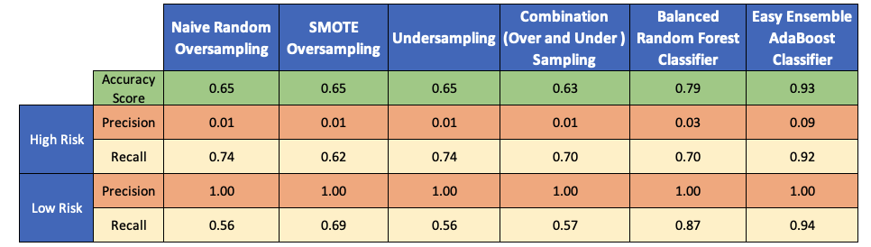

Use of Python to build and evaluate several machine learning models to predict credit risk.

### Overview of the statistical analysis:

Credit risk is an inherently unbalanced classification problem, as good loans easily outnumber risky loans. Therefore, in this challenge different techniques are employed to train and evaluate models with unbalanced classes. Imbalanced-learn and scikit-learn libraries were used to build and evaluate models using resampling.

Using the credit card credit dataset from LendingClub, a peer-to-peer lending services company, an oversample of data is performed using the RandomOverSampler and SMOTE algorithms, and undersample of the data using the ClusterCentroids algorithm. A combinatorial approach of over- and undersampling using the SMOTEENN algorithm is used. The two new machine learning models are then compared that reduce bias, BalancedRandomForestClassifier and EasyEnsembleClassifier, to predict credit risk. The performance is then evaluated of these models and a recommendation on whether they should be used to predict credit risk is presented in this report.

In this challenge, the following were performed:

- Deliverable 1: *Use Resampling Models to Predict Credit Risk*

- Deliverable 2: *Use the SMOTEENN Algorithm to Predict Credit Risk*

- Deliverable 3: *Use Ensemble Classifiers to Predict Credit Risk*

- Deliverable 4: *A Written Report on the Credit Risk Analysis*

### Results:

**Deliverable 1:** Use Resampling Models to Predict Credit Risk:

Summary: *Using the imbalanced-learn and scikit-learn libraries, three machine learning models are evaluated by using resampling to determine which is better at predicting credit risk. The oversampling RandomOverSampler and SMOTE algorithms are first used, and then followed by the undersampling ClusterCentroids algorithm. Using these algorithms, the dataset is resampled, the count of the target classes is viewed, a logistic regression classifier is trained, the balanced accuracy score is calculated, and a confusion matrix and a classification report is generated.* 

The script can be access via the link below:

[Link to the Credit Risk Resampling.ipynb](https://github.com/jsaltmd/Credit_Risk_Analysis/blob/master/credit_risk_resampling.ipynb)

**1. Naive Random Oversampling**

Based on the results, every single observation on the testing set was predicted at 65% by the model. The recall (sensitivity) values for prediction of higher risk loan is higher than lower risk loan. However, the precision for predicting higher risk loan is much lower than it is predicting for a lower risk loan.

- ***Balanced accuracy score:*** 0.65

- ***High risk precision:*** 0.01

- ***High risk recall:*** 0.74

- ***Low risk precision:*** 1.00

- ***Low risk recall:*** 0.56

**2. SMOTE Oversampling**

Based on the results, every single observation on the testing set was predicted at 65% by the model. The recall (sensitivity) values for prediction of higher and lower risk loans are in line with each other. However, the precision for predicting higher risk loan is much lower than it is predicting for a lower risk loan.

- ***Balanced accuracy score:*** 0.65

- ***High risk precision:*** 0.01

- ***High risk recall:*** 0.62

- ***Low risk precision:*** 1.00

- ***Low risk recall:*** 0.69

**3. Undersampling**

Based on the results, every single observation on the testing set was predicted at 54% by the model. The recall (sensitivity) values for prediction of higher risk loan is higher than lower risk loan. However, the precision for predicting higher risk loan is much lower than it is predicting for a lower risk loan.

- ***Balanced accuracy score:*** 0.54

- ***High risk precision:*** 0.01

- ***High risk recall:*** 0.67

- ***Low risk precision:*** 1.00

- ***Low risk recall:*** 0.42

**Deliverable 2:** Use the SMOTEENN algorithm to Predict Credit Risk:

Summary: *Using the imbalanced-learn and scikit-learn libraries, a combinatorial approach of over- and undersampling is used with the SMOTEENN algorithm to determine if the results from the combinatorial approach are better at predicting credit risk than the resampling algorithms from Deliverable 1. Using the SMOTEENN algorithm, the dataset is resampled, the count of the target classes is viewed, the logistic regression classifier is trained, the balanced accuracy score is calculated, and a confusion matrix and a classification report is generated.* 

The script can be access via the link below:

[Link to the Credit Risk Resampling.ipynb](https://github.com/jsaltmd/Credit_Risk_Analysis/blob/master/credit_risk_resampling.ipynb)

**1. Combination (Over and Under) Sampling**

Based on the results, every single observation on the testing set was predicted at 64% by the model. The recall (sensitivity) values for prediction of higher risk loan is higher than lower risk loan. However, the precision for predicting higher risk loan is much lower than it is predicting for a lower risk loan.

- ***Balanced accuracy score:*** 0.64

- ***High risk precision:*** 0.01

- ***High risk recall:*** 0.70

- ***Low risk precision:*** 1.00

- ***Low risk recall:*** 0.57

**Deliverable 3:** Use Ensemble Classifiers to Predict Credit Risk:

Summary: *Using the imblearn.ensemble library, two different ensemble classifiers are trained and compared, BalancedRandomForestClassifier and EasyEnsembleClassifier, to predict credit risk and evaluate each model. Using both algorithms, the dataset is resampled, the count of the target classes is viewed, logistic regression classifier is trained, the balanced accuracy score is calculated, and a confusion matrix and a classification report is generated.* 

The script can be access via the link below:

[Link to the Credit Risk Ensemble.ipynb](https://github.com/jsaltmd/Credit_Risk_Analysis/blob/master/credit_risk_ensemble.ipynb)

**1. Balanced Random Forest Classifier**

Based on the results, every single observation on the testing set was predicted at 79% by the model. The recall (sensitivity) values for prediction of lower risk loan is higher than higher risk loan. However, the precision for predicting higher risk loan is much lower than it is predicting for a lower risk loan.

- ***Balanced accuracy score:*** 0.79

- ***High risk precision:*** 0.03

- ***High risk recall:*** 0.70

- ***Low risk precision:*** 1.00

- ***Low risk recall:*** 0.87

**2. Easy Ensemble AdaBoost Classifier**

Based on the results, every single observation on the testing set was predicted at 93% by the model. The recall (sensitivity) values for prediction of higher and lower risk loans are in line with each other. However, the precision for predicting higher risk loan is much lower than it is predicting for a lower risk loan.

- ***Balanced accuracy score:*** 0.93

- ***High risk precision:*** 0.09

- ***High risk recall:*** 0.92

- ***Low risk precision:*** 1.00

- ***Low risk recall:*** 0.94

### Summary:

Below are the results summary of all the machine learning analysis models: 

- Overall, the recall (sensitivity) of predicting higher risk loan is higher compared to detecting lower risk loan for Naive Random Oversampling, Undersampling, and Combination (Over and Under) Sampling. The recall for both Smote Oversampling and Balanced Random Forest Classifier have higher prediction for lower risk loans. The Easy Ensemble AdaBoost Classifier model have comparable values for both higher and lower. 

- The precision for predicting higher risk loan is much lower across all machine learning analysis models compared to predicting lower risk loan. 

- Out of the six models, the Easy Ensemble AdaBoost Classifier has the highest score of 0.93, followed by the Balanced Random Forest Classifier with 0.79. The rest of the models have a score of 0.63 - 0.65. 

- Out of the six models, the Easy Ensemble AdaBoost Classifier is ideal to use. With this data analysis, it is better to have higher sentivity in order to detect loans that have higher risks because it will produced true positives. In the ideal situation, both precision and recall should be balanced. However, in this model, the precision results is low to predict high risk loans. It means that it may not still be a useful algorithm and it is also reflected by the F1 scores. I would recommend to further clean (remove unwanted data by trial and error) and reassess.